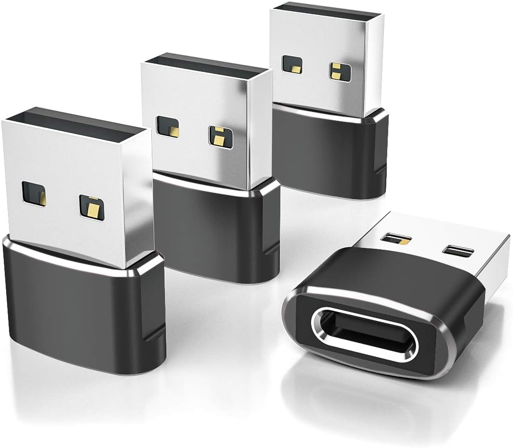
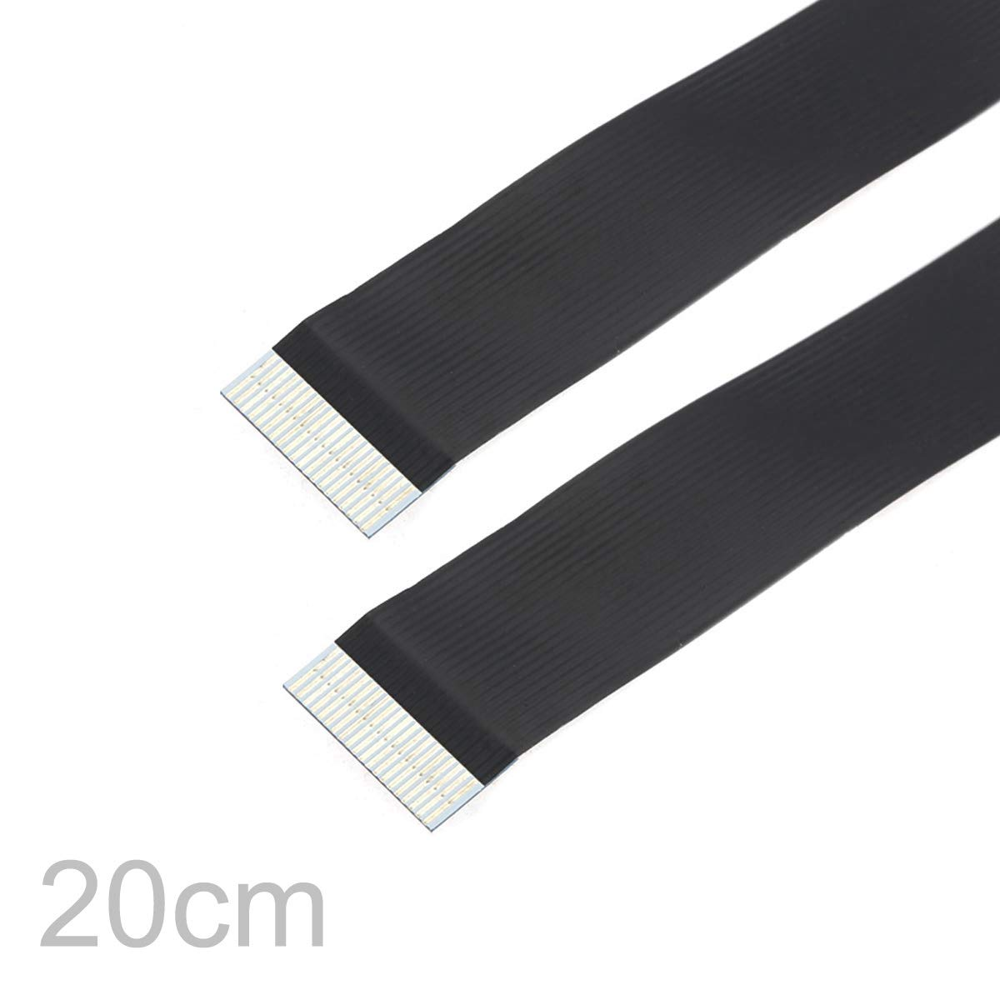
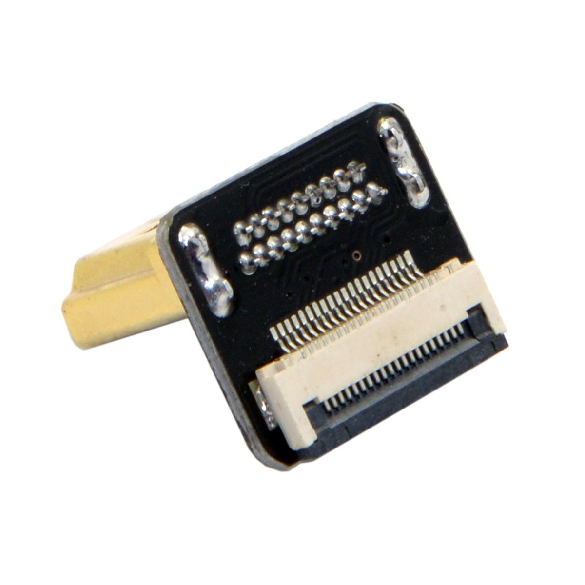
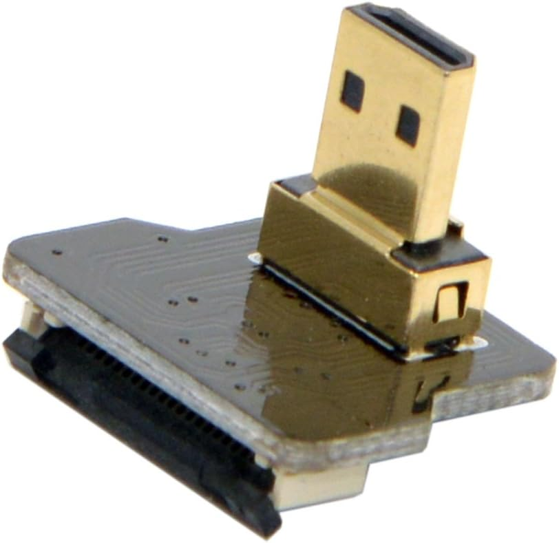

# gadget
🔦

(Still very WIP; instructions may be inaccurate. See also
[gadget2](https://github.com/FolkComputer/gadget2) which uses
easier-to-get projector part and has a battery and a bunch of other
advancements)

Very tentative design. Sort of minimum viable design to prototype
handheld interactions.


Open-back until it's more stable (sometimes you want to replug
the projector, sometimes you want to plug in a USB keyboard to
manually reconfigure if it's off Wi-Fi)

## Bill of materials

### 3D prints

- Gadget chassis
  - This prints in 2 parts: Chassis and front panel
    - (for front panel, should choose either Ultimems version with
      smaller projector slit, or Nebra version with larger slit [since
      the Nebra is shifted a little toward the side])
- Handle grip with trigger button (in vendor/)
  - This prints in 3 parts so far: Main grip, thumbwheel, block
  - (Trigger inset itself is TODO)

(can view in https://3dviewer.net -- for the gadget chassis, the
Gadget.shapr file is canonical / used to edit in Shapr3D, the derived
files are generated from it)

### Electronics

- Ultimems HD305D1-C1 ([manual](https://www.ultimems.com/download/hd305d1-c1_rev1_0_20231005_english/)) (recommended) or Nebra AnyBeam (should fit)
  - There is a newer Ultimems unit
    [HD309D1-C1](https://raspberry-pi.ksyic.com/main/index/pdp.id/1053/pdp.open/1053)
    which I haven't tested yet
  - **You should probably go into the Ultimems onboard settings (with
    the wheel-button) and disable autokeystone and autorotate.**
- [Raspberry Pi 5 2GB or more](https://www.microcenter.com/product/683269/5;_Broadcom_BCM2712_Quad-Core_Cortex-A76;_2GB_LPDDR4X_RAM)
  - (only the Pi 5 is guaranteed to supply the 5V1.1A
    over USB port to power the projector)
  - [Pi 5 active cooler (fan)](https://www.microcenter.com/product/671930/5_Active_Cooler)
  - microSD card
  - [27W Pi 5 USB-C power supply](https://www.microcenter.com/product/671926/27W_USB-C_PSU_-_White)
    - (you cannot use an off-the-shelf USB-C power supply; you must
      use this one)
    - TODO: battery system
- [ELP 3DGS1200P01 V83 stereo USB camera](https://www.amazon.com/dp/B0DQ4R9S6W)

### Cables

- [USB-C male-to-female 180-degree angle
  adapter](https://www.amazon.com/gp/product/B0BXCTRN7F?ie=UTF8&psc=1)
  - 
- [20cm USB-C male-to-female extension cable with panel-mount screw
  hole](https://www.amazon.com/gp/product/B075P2FF7L?ie=UTF8&psc=1)
  - 
- [7.5cm 65W USB-C Type C to USB-C Ultra Slim Flat Power USB2.0 Data Angled
Cable](https://www.amazon.com/gp/product/B0D25V9QYG?ie=UTF8&th=1)
  - (to power projector from Pi)
  -  
  - [USB-A plug to USB-C jack
    microadapter](https://www.adafruit.com/product/5461?gad_source=1) to fit
    in Pi USB port
    - 
    - any adapter will work (like
      https://www.amazon.com/gp/product/B07LF72431 ), but small is good
- short microhdmi to hdmi ribbon cable:
  - [20cm HDMI ribbon cable](https://www.amazon.com/dp/B0C36GT7HC) (15cm
    might also work?)
    - 
  - [HDMI type-A male connector up-angled 90
    degree](https://www.amazon.com/dp/B0C36K9GT6)
    - 
  - [micro-HDMI type-D male connector up-angled 90
    degree](https://www.amazon.com/JSER-Angled-Degree-Multicopter-Photography/dp/B01M6VFMFG/)
    - 


### Other

- 4x 6mm M2 bolts (for mounting camera to front panel)
  - OR TODO bolts
- 4x [M2 nylock nuts](https://www.amazon.com/dp/B07BCC3NJ2) (for
    mounting camera to front panel)
  - 
- 4x 10mm M2.5 standoffs for Pi 5
- 4x 6mm M2.5 bolts for Pi 5 <-> standoffs
- 4x 6mm M2.5 bolts for standoffs <-> chassis
- 2x 4mm M2.5 bolts for front panel
  - 2x M2.5 heat set inserts for front (to bolt front panel onto)
- 1x 1/4" bolt for top
- 1x [1/4" 6mm x 8mm heat set insert](https://www.amazon.com/gp/product/B094H2269W/ref=ppx_yo_dt_b_search_asin_title?ie=UTF8&psc=1) for bottom

## Software setup

Flash Raspberry Pi OS Lite (64-bit).

Add to config.txt on the boot partition of the SD card (see the Ultimems manual and
https://volzo.de/posts/raspberry-pi-projectors/ ) (this mounts as
/boot/firmware/config.txt, so can also edit there over ssh):

```
# For Ultimems projector:
hdmi_force_hotplug=1
hdmi_drive=2
config_hdmi_boost=4
hdmi_group=2
hdmi_mode=14
#hdmi_safe=1
```

Boot the Pi. Ssh in and follow Folk README setup instructions.

If the HDMI output on the projector is garbled, [EDID might be messed
up.](https://forums.raspberrypi.com/viewtopic.php?t=362124) try adding
`video=HDMI-A-1:1280x720M@60D` to /boot/firmware/cmdline.txt on the SD
card.

If `vulkaninfo --summary` only shows the llvmpipe software Vulkan
device and not the V3DV Mesa device (the actual hardware GPU), try
updating the kernel and GPU drivers with `sudo rpi-update`.

Use apt to install libcamera0.3 and libcamera-dev.

Use `sudo nmtui` to add more Wi-Fi networks.

Create ~/folk-live/setup.folk to set the camera to use wide-angle
resolution and to create moving dashed outline around the perimeter of
the projection:

```
Assert $this wishes $::thisNode uses camera "/base/axi/pcie@120000/rp1/i2c@88000/imx708@1a" with width 1280 height 1024

Assert $this wishes $::thisNode uses display 0

When display /disp/ has width /w/ height /h/ {
  When the clock time is /t/ {
    Wish to draw a dashed stroke with points [list [list 0 0] [list $w 0] [list $w $h] [list 0 $h] [list 0 0]] color white width 10 dashlength 40 dashoffset [expr {fmod($t, 10)*-120}]
  }
}
```

(the camera path may be different, Folk will print all valid camera paths
in its journal at boot if you need to check: `sudo journalctl -u folk -n 30`)

### Ad-hoc Wi-Fi

[Disable
NetworkManager](https://askubuntu.com/questions/1091653/how-do-i-disable-network-manager-permanently)
(I have found it [impossible](https://x.com/rsnous/status/1853870032289431665) to get ad-hoc Wi-Fi to work using it):

```
$ sudo systemctl stop NetworkManager.service
$ sudo systemctl disable NetworkManager.service
$ sudo systemctl stop NetworkManager-wait-online.service
$ sudo systemctl disable NetworkManager-wait-online.service
$ sudo systemctl stop NetworkManager-dispatcher.service
$ sudo systemctl disable NetworkManager-dispatcher.service
```

Edit your setup.folk to run the iwconfig and ip commands to make an
ad-hoc network:

```
if {[catch {exec ip address | grep 169.254.34.2}]} {
    exec sudo iwconfig wlan0 mode ad-hoc
    exec sudo iwconfig wlan0 essid gadget-pink
    exec sudo ip link set wlan0 up
    exec sudo ip addr add 169.254.34.2/16 dev wlan0
}
```

You should be able to ssh into `folk@169.254.34.2` from any other computer on the
gadget-pink network now.
