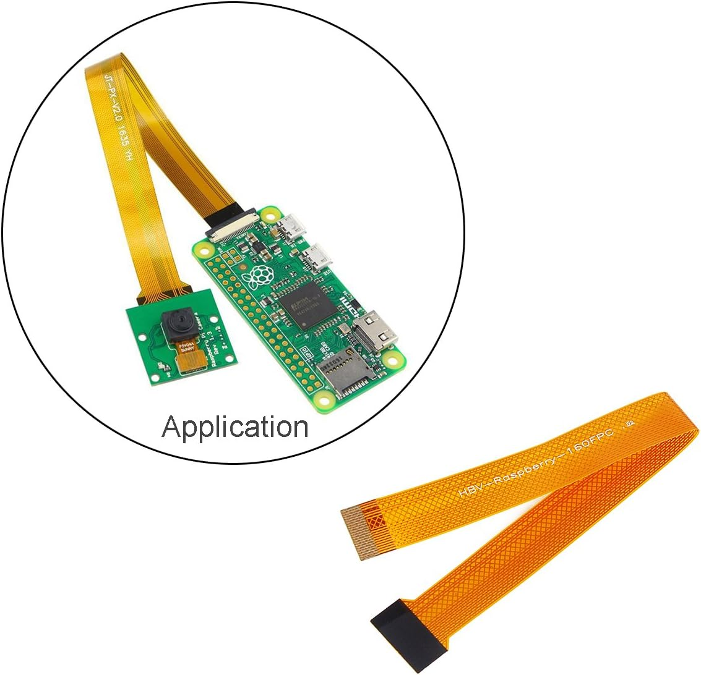
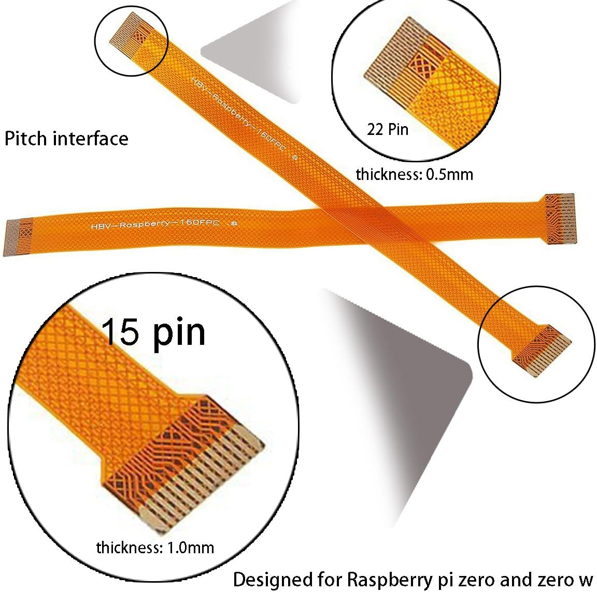
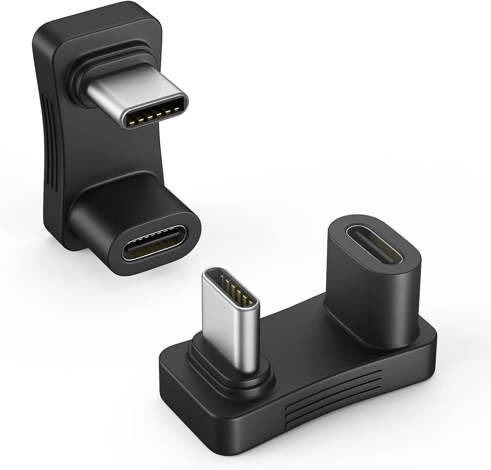
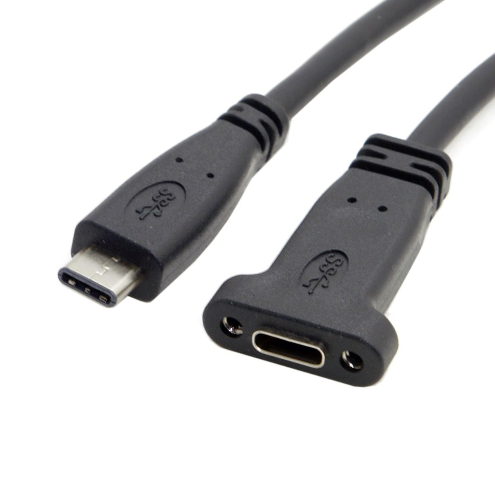
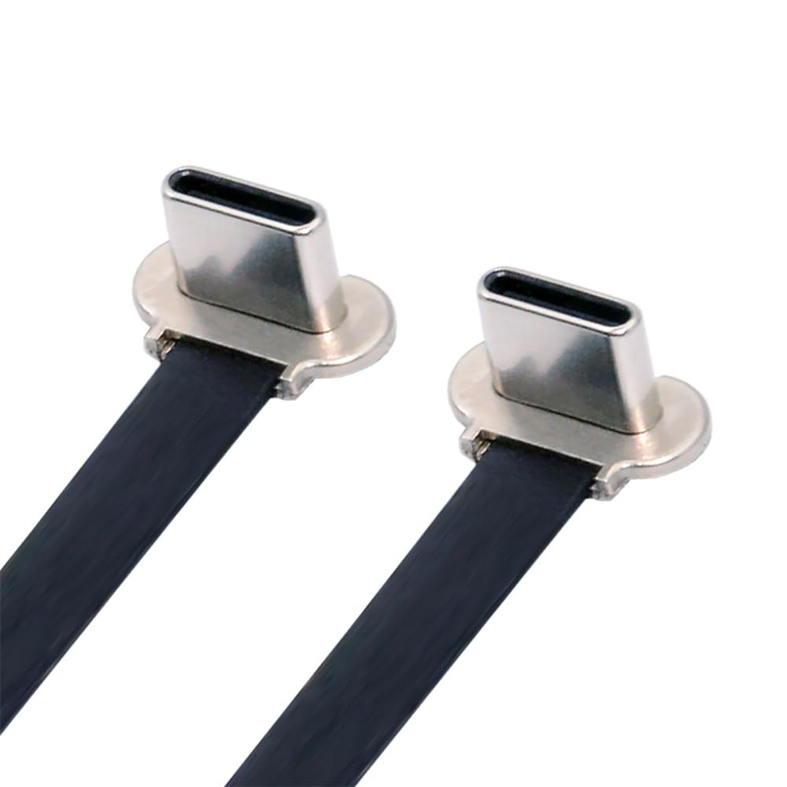
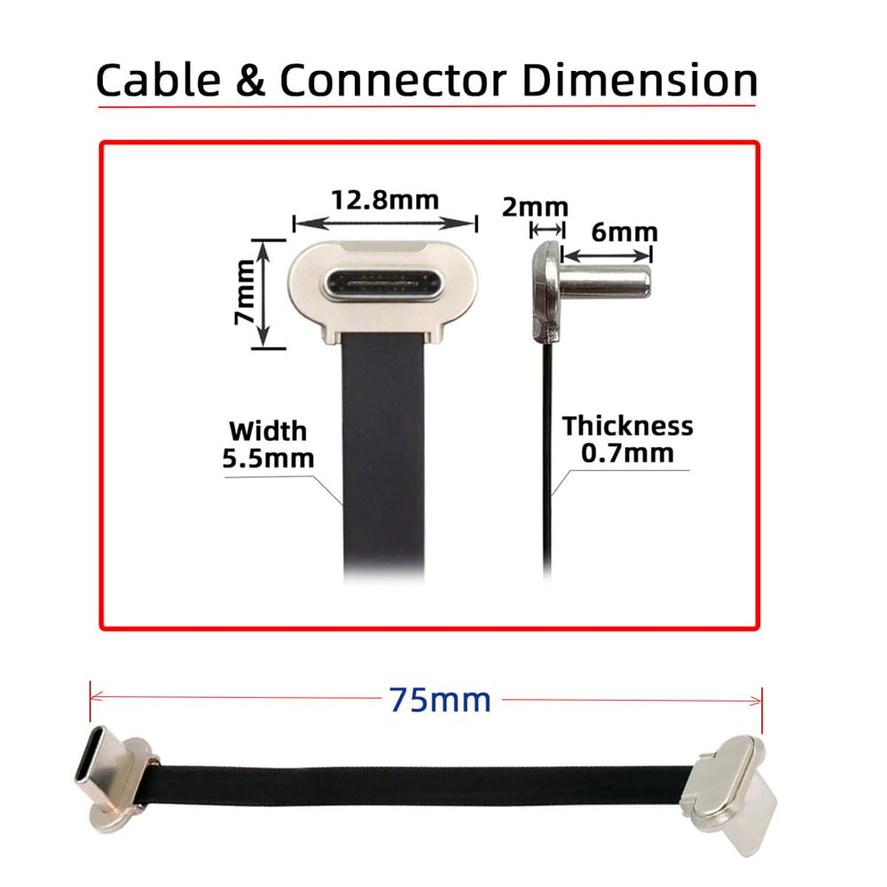

# gadget
🔦

Very tentative design. Sort of minimum viable design to prototype
handheld interactions.

Open-back until it's more stable (sometimes you want to replug
the projector, sometimes you want to plug in a USB keyboard to
manually reconfigure if it's off Wi-Fi)

## Bill of materials

### 3D prints

- Gadget chassis
  - This prints in 2 parts: Chassis and front panel
    - (for front panel, should choose either Ultimems version with
      smaller projector slit, or Nebra version with larger slit [since
      the Nebra is shifted a little toward the side])
- Handle grip with trigger button (in vendor/)
  - This prints in 3 parts so far: Main grip, thumbwheel, block
  - (Trigger inset itself is TODO)

(can view in https://3dviewer.net -- for the gadget chassis, the
Gadget.shapr file is canonical / used to edit in Shapr3D, the derived
files are generated from it)

### Electronics

- Ultimems HD305D1-C1 ([manual](https://www.ultimems.com/download/hd305d1-c1_rev1_0_20231005_english/)) (recommended) or Nebra AnyBeam (should fit)
  - There is a newer Ultimems unit [HD309D1-C1](https://raspberry-pi.ksyic.com/main/index/pdp.id/1053/pdp.open/1053) which I haven't tested yet
- Raspberry Pi 5
  - (only the Pi 5 is guaranteed to supply the 5V1.1A
    over USB port to power the projector)
  - Pi 5 active cooler (fan)
  - microSD card
  - 27W Pi 5 USB-C power supply
    - (you cannot use an off-the-shelf USB-C power supply; you must
      use this one)
    - TODO: battery system
- [Raspberry Pi Camera 3 Wide](https://www.microcenter.com/product/662018/raspberry-pi-camera-3-wide) (NOT NoIR)
  - [15-pin-to-22-pin "Pi Zero Camera
    Cable"](https://www.amazon.com/dp/B0716TB6X3) (special, not the
    one that comes with camera -- Pi 5 has narrower MIPI ports)
    -  

### Cables

- [USB-C male-to-female 180-degree angle
  adapter](https://www.amazon.com/gp/product/B0BXCTRN7F?ie=UTF8&psc=1)
  - 
- [20cm USB-C male-to-female extension cable with panel-mount screw
  hole](https://www.amazon.com/gp/product/B075P2FF7L?ie=UTF8&psc=1)
  - 
- [7.5cm 65W USB-C Type C to USB-C Ultra Slim Flat Power USB2.0 Data Angled
Cable](https://www.amazon.com/gp/product/B0D25V9QYG?ie=UTF8&th=1)
  - (to power projector from Pi)
  -  
- short microhdmi to hdmi ribbon cable

### Other

- 4x 6mm M2 bolts (for mounting camera to front panel)
- 4x [M2 nylock nuts](https://www.amazon.com/dp/B07BCC3NJ2) (for
    mounting camera to front panel)
  - 
- 8x M2.5 bolts for Pi 5 <-> standoffs <-> chassis
- 4x M2.5 standoffs for Pi 5
- 2x M2.5 bolts for front panel
  - 2x M2.5 heat set inserts for front (to bolt front panel onto)
- 1x 1/4" bolt for top
- 1x 1/4" heat set insert for bottom

## Software setup

Flash Raspberry Pi OS Lite.

Add to boot/config.txt on the SD card:

```
# For Ultimems projector:
hdmi_force_hotplug=1
hdmi_drive=2
config_hdmi_boost=4
hdmi_group=2
hdmi_mode=14
#hdmi_safe=1
```

Boot the Pi. Ssh in and follow Folk README setup instructions.

Use apt to install libcamera0.3 and libcamera-dev.

Use `sudo nmtui` to add more Wi-Fi networks.

Create ~/folk-live/setup.folk to set the camera to use wide-angle
resolution and to create moving dashed outline around the perimeter of
the projection:

```
Assert $this wishes $::thisNode uses camera "/base/axi/pcie@120000/rp1/i2c@88000/imx708@1a" with width 1280 height 1024

Assert $this wishes $::thisNode uses display 0

When display /disp/ has width /w/ height /h/ {
  When the clock time is /t/ {
    Wish to draw a dashed stroke with points [list [list 0 0] [list $w 0] [list $w $h] [list 0 $h] [list 0 0]] color white width 10 dashlength 40 dashoffset [expr {fmod($t, 10)*-120}]
  }
}
```

(the camera path may be different, Folk will print all valid camera paths
in its journal at boot if you need to check: `sudo journalctl -u folk -n 30`)
